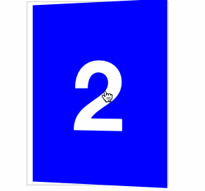
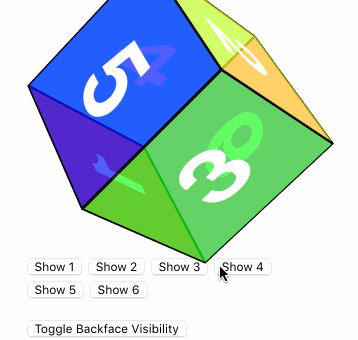
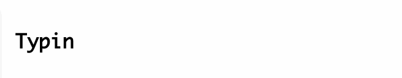

# CSS3

- gradient-border-color.html: 实现边框的渐变效果，一种是利用伪元素的方式，另一种方式是利用CSS3中的border-image属性实现。

- [transform/transform-cardfilp.html](http://xchb.work/CSS3/transform/transform-cardfilp.html): 实现卡片翻转效果

  

- [transform/transform-cube.html](http://xchb.work/CSS3/transform/transform-cube.html): 实现魔方效果

  

## 动画效果
### step动画效果展示
1. [模拟文本输入](http://xchb.word/CSS3/animation/animation-step-typing.html)

   